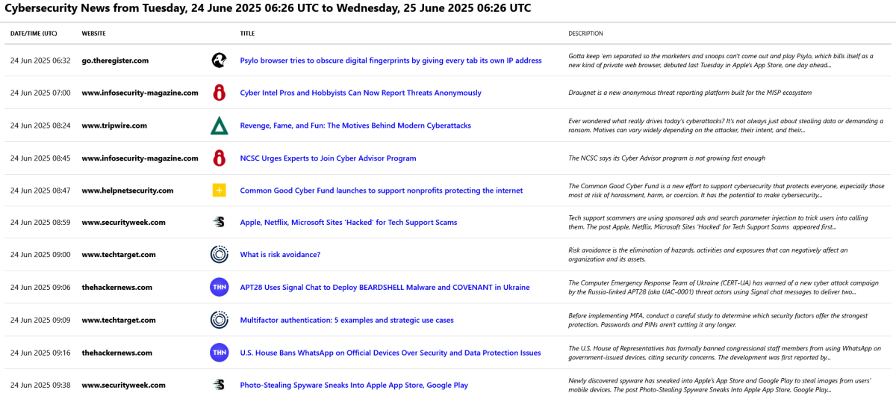

# CyberFeedBites: Lightweight Cybersecurity RSS Reader

CyberFeedBites is a lightweight Python tool that provides an overview of recent cybersecurity news by aggregating multiple RSS feeds. It includes a curated, customisable OPML file of cybersecurity news sources.



## Features

- Collects and processes cybersecurity news from various RSS feeds (curated list already included in an OPML file).  
- Fetches cybersecurity news from the past N days (default: 7 days).
- Generates HTML, JSON and CSV files with news titles, brief descriptions, and links to articles, sorted by date, providing an overview of the latest cybersecurity news.  
- Includes a customisable OPML file with a list of notable cybersecurity RSS sources.
- Supports asynchronous HTTP fetching using `aiohttp` for improved performance.

## Quick Start
CyberFeedBites is ready to use once dependencies are installed. To run it as is, follow these steps to fetch the latest 24-hour articles from the sources listed in the provided `cybersecnews-sources.opml` file and generate a summary as HTML, JSON and CSV files saved in the `data/html_reports/` and `data/csv_reports/` directories:

1. Clone the repository: `git clone https://github.com/dsgandurra/cyberfeedbites.git`
2. Move to the root folder: `cd cyberfeedbites`
3. Install dependencies: `pip install -r requirements.txt`
4. Run CyberFeedBites: `python src/main.py`
5. Check the generated HTML file in the `data/html_reports/` directory.

## Installation

1. Clone this repository:

    ```bash
    git clone https://github.com/dsgandurra/cyberfeedbites.git
    cd cyberfeedbites
    ```

2. Before running CyberFeedBites, it's recommended to use a virtual environment to keep your project's dependencies isolated. To do so, create and activate a virtual environment:

   On **Linux/macOS**:
   ```bash
   python3 -m venv myenv
   source myenv/bin/activate
   ```

   On **Windows**:
   ```bash
   python -m venv myenv
   .\myenv\Scripts\activate
   ```
   
3. Install the required dependencies:

    ```bash
    pip install -r requirements.txt
    ```

The required packages are:

- `feedparser`: For parsing RSS feeds.
- `beautifulsoup4`: For HTML parsing and manipulation.
- `aiohttp`: For asynchronous HTTP requests to speed up feed fetching.
- `requests`: For robust HTTP fetching with custom headers.
- `tldextract` — extracting domain names from URLs

## Usage

1. Navigate to the root folder of the project:

    ```bash
    cd path/to/cyberfeedbites
    ```

2. Run CyberFeedBites with optional parameters:

    ```bash
    python src/main.py [--start <start_days_ago>] [--end <end_days_ago>] [--opml <opml_file_path>] [--output-format <formats>] [--output-html-folder <folder>] [--output-csv-folder <folder>] [--output-json-folder <folder>] [--align-start-to-midnight] [--align-end-to-midnight] [--html-img] [--max-length-description <length>] [--exclude-keywords] [--exclude-keywords-file <file>] [--print-retrieved] [--print-skipped] [--order-by {date,title_date}]
    ```

- `--start`: Number of days ago to start fetching news (default: 1).
- `--end`: Number of days ago to end fetching news (default: 0).
- `--opml`: Path to the OPML file to use (default as configured).
- `--output-format`: Comma-separated list of output formats (html, csv, json). Default is all.
- `--output-html-folder`: Folder for HTML output (default configured).
- `--output-csv-folder`: Folder for CSV output (default configured).
- `--output-json-folder`: Folder for JSON output (default configured).
- `--align-start-to-midnight`: Align start date to midnight.
- `--align-end-to-midnight`: Align end date to 23:59:59.
- `--max-length-description`: Maximum length for RSS feed descriptions (default: 200).
- `--exclude-keywords`: Enable exclusion of entries containing specific keywords.
- `--exclude-keywords-file`: Path to a file containing keywords to exclude, one per line. Overrides default keywords.
- `--print-retrieved`: Print retrieved articles summary at the end.
- `--print-skipped`: Print skipped articles summary at the end.
- `--order-by`: Order HTML output by `date` (default) or `title_date`.
- `--html-img`: Include images in the HTML output (default is False).
- `--aggressive-filtering`: Enable removal of articles that do NOT include any security keywords. Default is False.
- `--aggressive-keywords-file`: Path to a file containing security keywords to keep, one per line. Overrides default cybersecurity keywords.

Examples:
- Fetch news from the last 1 day (default):

  ```bash
  python src/main.py
  ```

- Fetch news from 5 to 2 days ago:

  ```bash
  python src/main.py --start 5 --end 2
  ```
- Generate only CSV output:
  ```bash
  python src/main.py --output-format csv
  ```

- Exclude entries containing keywords (using default or file):
  ```bash
  python src/main.py --exclude-keywords --exclude-keywords-file exclude.txt
  ```

## Output

The resulting HTML, JSON and CSV files, which list the news from the past 'X' days, will be saved in the `data/html_reports`, `data/json_reports`, and `data/csv_reports` folders, respectively. The filenames will be in the following format:

- <prefix>_YYYY-MM-DD_HH-MM-SS.html
- <prefix>_YYYY-MM-DD_HH-MM-SS.json
- <prefix>_YYYY-MM-DD_HH-MM-SS.csv

Where <prefix> is derived from the `category` attribute of the top-level `<outline>` element in the OPML file (with special characters removed and all letters converted to lowercase). If that attribute is missing, the `text` attribute will be used instead. If both are missing, an error will be raised. 

In the provided OPML file, the top-level `<outline>` element contains `category="Cybersecurity News"`, so the resulting filename will begin with `cybersecuritynews`.

Each HTML file contains a table with the following columns:

- **ID**: The article's position in the list.  
- **Date**: The date the article was published.  
- **Website**: The name of the website and logo of the channel (if available or if stored in the OPML file).  
- **Title**: The title of the article.  
- **Description**: A brief description of the article.  
- **Link**: The URL to the full article.

Each JSON file has the following format:

- **title**: The title of the article.  
- **link**: The URL to the full article.
- **published**: The date the article was published.
- **source**: The website name of the source.
- **description**: A brief description of the article.  

Each CSV file contains a table with the following columns:

- **Date**: The date the article was published.  
- **Website**: The name of the website.  
- **Title**: The title of the article.  
- **Description**: A brief description of the article.  
- **Link**: The URL to the full article.

## Sample OPML File

The repository includes a sample OPML file (`data/rss_sources/cybersecnews-sources.opml`) containing a curated list of relevant RSS sources. You can edit this file to add or remove RSS feed URLs according to your preferences or use a custom OPML file by passing its path via the `--opml` option.

## OPML File Structure

CyberFeedBites expects **each OPML file to include only one top-level `<outline>` element** (i.e., one section or feed group, e.g., `<outline text="Cybersecurity News" title="Cybersecurity News Feeds" category="Cybersecurity News">`). Based on this, the program generates report files (HTML, JSON, CSV) using the top-level outline's `category` attribute (or `text`, if missing) as the filename prefix. If multiple top-level outlines are present in one OPML file, only the first will be processed; others will be ignored. Hence, to organise feeds into multiple categories or sections, split them into separate OPML files—one per category—and run CyberFeedBites separately for each. This keeps the program simple and avoids handling multiple output files or combined reports, while allowing different look-back periods for different categories or sections.

## Customisation

- The `MAX_DAYS_BACK` parameter in `config.py` limits the maximum number of days allowed as input to prevent fetching an excessive number of RSS entries. You can increase this limit by editing the variable in `config.py`.
- You can also add or remove RSS feed sources by editing the `cybersecnews-sources.opml` file. Alternatively, you can use a different OPML file as parameter, allowing multiple feed sets to be maintained separately.
- CyberFeedBites generates HTML output based on a template located in the `data/templates` folder. The template also includes `sorttable.js` to enable sortable tables. You can modify `template.html` and the accompanying `style.css` for customisation. If you choose a different directory to store the HTML reports, ensure the style CSS and `sorttable.js` references are updated accordingly.

## License

This project is licensed under the GPL-3.0 License - see the [LICENSE](LICENSE) file for details.